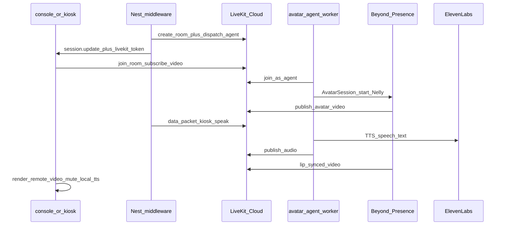

# Beyond Presence speech-to-video (LiveKit)

## Goal

Keep the existing visit flow (Nest state machine, Socket.io, yes/no/keypad, ElevenLabs TTS text from [`i18n.ts`](middleware/src/modules/kiosk/i18n.ts)). Replace only the visual face: canvas/Rive lip-sync → Beyond Presence HD avatar video.

Default stock avatar: **Nelly** `694c83e2-8895-4a98-bd16-56332ca3f449`.

## Architecture

Nest still owns conversation. The LiveKit agent is a **speaker only** (no LLM turns). User input stays on Nest (touch / STT).

## Prerequisites (you provide)

Before coding can be verified end-to-end:

1. [LiveKit Cloud](https://cloud.livekit.io) project → `LIVEKIT_URL`, `LIVEKIT_API_KEY`, `LIVEKIT_API_SECRET`
2. [Beyond Presence Studio](https://bey.studio/settings/api-keys) → `BEY_API_KEY`
3. Keep existing ElevenLabs keys/voice (agent TTS uses the same voice id)

## Concrete design choices

- **Adapter switch:** `AVATAR_ADAPTER=bey|canvas` (default `canvas` until keys exist; `bey` enables video path).
- **Worker location:** new package [`middleware/avatar-agent/`](middleware/avatar-agent/) (Node LiveKit Agents + `@livekit/agents-plugin-bey`), separate process from Nest.
- **Room naming:** `kiosk-{gateId}-{sessionId}` created when a kiosk session starts.
- **Speak trigger:** Nest publishes a LiveKit data message `kiosk.speak` with `{ text, lang }` whenever `lastPromptSpeech` changes (same moment as today's `session.update`). Agent calls `session.say(text)` with ElevenLabs TTS; BEY consumes that audio.
- **Browser audio:** when `bey`, do **not** play Nest `/tts` through `#ttsAudio`; subscribe to LiveKit audio/video from the avatar/agent participants instead (avoids double audio).
- **Fallback:** if BEY/LiveKit fails, fall back to current canvas + `/tts` path and surface status.

## Implementation steps

### 1. Config

Extend [`middleware/src/config/env.validation.ts`](middleware/src/config/env.validation.ts) + [`middleware/.env.example`](middleware/.env.example):

- `AVATAR_ADAPTER` = `bey` | `canvas`
- `LIVEKIT_URL`, `LIVEKIT_API_KEY`, `LIVEKIT_API_SECRET`
- `BEY_API_KEY`, `BEY_AVATAR_ID` (default Nelly id)
- Reuse `ELEVENLABS_*` inside the agent worker `.env`

### 2. Nest LiveKit module

Add `middleware/src/modules/livekit/`:

- Token minting for browser identity `kiosk-ui-{sessionId}`
- Room create + [agent dispatch](https://docs.livekit.io/agents/worker/agent-dispatch/) for worker name `tamkeen-avatar`
- `speak(roomName, text, lang)` via data packet
- Hook from [`kiosk.service.ts`](middleware/src/modules/kiosk/kiosk.service.ts) after `pushSession`: if `AVATAR_ADAPTER=bey`, ensure room/agent, then `speak(session.lastPromptSpeech)`
- Expose `GET /avatar/token?session_id=` (or include `livekit: { url, token, room }` on `PublicSession`) so the UI can join

### 3. Avatar agent worker

New [`middleware/avatar-agent/`](middleware/avatar-agent/):

- `@livekit/agents` + `@livekit/agents-plugin-bey` + ElevenLabs TTS plugin (or HTTP call to Nest `/tts` then play — prefer LiveKit ElevenLabs TTS plugin with same `ELEVENLABS_TTS_VOICE_ID`)
- On entry: `new bey.AvatarSession({ avatarId })` → `avatar.start(session, room)`
- Disable free-form LLM dialogue; only react to `kiosk.speak` data messages with `session.say(text)`
- Scripts: `npm run avatar-agent` from middleware root

### 4. Frontend (console first, then kiosk)

Update [`middleware/public/console.html`](middleware/public/console.html) / [`console.js`](middleware/public/console.js) (and mirror in `index.html` / `app.js`):

- Add `<video id="beyVideo" autoplay playsinline>` mount; hide canvas when bey active
- Add `livekit-client`; on session start join with token from Nest
- Subscribe to remote video (participant identity ~ `bey-avatar-agent`) and agent audio
- Change `applyPromptSpeech`: if bey mode, Nest already triggered speak — UI only waits/renders; if canvas mode, keep current `/tts` + `playWavAndLipSync`
- Keep Socket.io session UI (prompt text, buttons, keypad) unchanged

### 5. Docs / runbook

Short section in [`middleware/README.md`](middleware/README.md): start Nest + Redis + `avatar-agent` worker; required env; how to verify Nelly appears on visit start.

## Out of scope

- Replacing Nest conversation with a BEY managed agent / iframe
- Custom BEY avatar training
- Pipecat path
- Changing `i18n` speech copy

## Verification

1. `AVATAR_ADAPTER=canvas` → existing silent-safe canvas path still works
2. With LiveKit + BEY keys and worker running: start visit in console → Nelly video joins → greeting audio plays once with lip sync → yes/no still advances Nest state → next prompt triggers another `kiosk.speak`
3. Kill worker → UI falls back or shows clear avatar error without breaking session buttons
