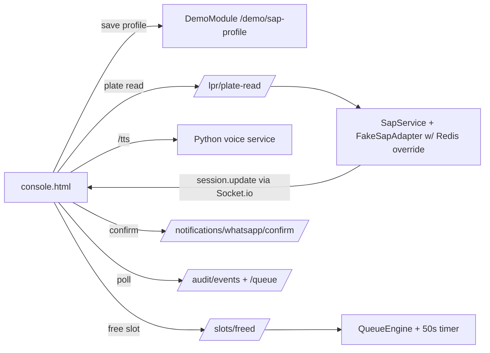

# Demo Console: full-flow testing UI + middleware DemoModule

## Goal

One page where you can, per run: pick a gate, type the LPR plate read, type the SAP profile that "SAP" should return, fire the flow, watch the avatar talk and walk the visit, see the queue after gate-open, press "Free a slot" to trigger dummy notifications with the 50s claim countdown, and confirm/timeout — all live, demo-ready for CTO/CEO.

## Middleware — new isolated `DemoModule`

New folder `middleware/src/modules/demo/` (demo-only seam; no business module is modified except one small extension to the fake SAP adapter, which is already a test adapter):

- **`POST /demo/sap-profile`** — register `{ plateNumber, name, phone }` as the profile the fake SAP returns for that plate. Store in Redis (`demo:sap:{plate}`). [middleware/src/modules/sap/fake-sap.adapter.ts](middleware/src/modules/sap/fake-sap.adapter.ts) gets one addition: check the Redis override first, then fall back to the hardcoded directory. Business flow (SapService, events) untouched.
- **`GET /demo/config`** — returns `claimTimeoutMs` (from env) so the UI can render the countdown.
- **`POST /demo/reset`** — clears demo state for a clean run: `qms:*`, `kiosk:*`, `lpr:active:*`, `demo:sap:*`, `audit:events` keys.
- Everything else reuses existing endpoints (no new business surface): `POST /lpr/plate-read`, `GET /queue`, `POST /slots/freed`, `POST /notifications/whatsapp/confirm`, `GET /audit/events`, plus the existing Socket.io `/kiosk` gateway for live session pushes.

Register `DemoModule` in [middleware/src/app.module.ts](middleware/src/app.module.ts).

## Kiosk UI — new demo console page (existing kiosk page stays as-is)

New files in `kiosk-voice/kiosk-ui/` (served by the same FastAPI static mount, so `/tts` stays relative):

- **`mw-api.js`** — UI service layer: a small client wrapping every middleware call (`sapProfile`, `plateRead`, `queue`, `slotFreed`, `whatsappConfirm`, `auditEvents`, `demoConfig`, `reset`) plus the Socket.io connect/join helper. Console code never fetches directly — keeps UI logic separate from API plumbing.
- **`console.html`** — demo console layout (same visual style as index.html):
  1. **Config panel** — middleware URL, gate ID, Reset run button.
  2. **LPR simulator** — plate input → "Send plate read".
  3. **SAP simulator** — name / phone / plate → "Save SAP profile" (call before sending the plate).
  4. **Avatar + session panel** — reuses `avatar.js`; joins `gate:{gateId}` room; when `session.update` arrives (SAP found → kiosk session started) the avatar speaks the prompt via `/tts` automatically and the Yes/No/keypad/hold-to-talk controls drive the flow (logic ported from app.js via shared helpers).
  5. **Queue panel** — live table from `GET /queue` (entry, phone, status, slot), refreshed on socket/audit activity; "Free a slot" button → `POST /slots/freed`; when an entry turns `notified`, show the dummy channels (WhatsApp/SMS/App) + a live 50s countdown from `notifiedAt + claimTimeoutMs`, with a "WhatsApp confirm" button per notified entry and visible shift-back when it times out.
  6. **Event timeline panel** — polls `GET /audit/events` and renders the domain-event feed (plate read → sap found → session → gate opened → enqueued → notified → confirmed/shifted) — the "talking" story for the demo.
- **`console.js`** — page logic using `mw-api.js` + `avatar.js`.

## Out of scope

No changes to state machine, queue logic, gate, or notifications behavior; no auth; Arabic stays off.

## Verification

- With Redis + middleware + Python voice server running: open `http://127.0.0.1:8080/console.html`, register a custom SAP profile (e.g. "Mahmoud / 0555…"), send that plate from the LPR panel, confirm the avatar greets with the custom name, answer Yes, see the entry in the queue, free a slot, watch notify + countdown, confirm via the button, and watch the timeline. Also run one timeout cycle to show shift-back.
- Re-run `middleware/scripts/prove_flow.sh` to confirm business flow untouched; update `releases.md`.