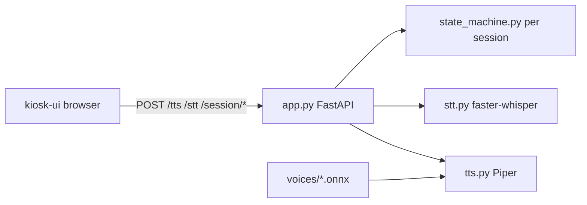
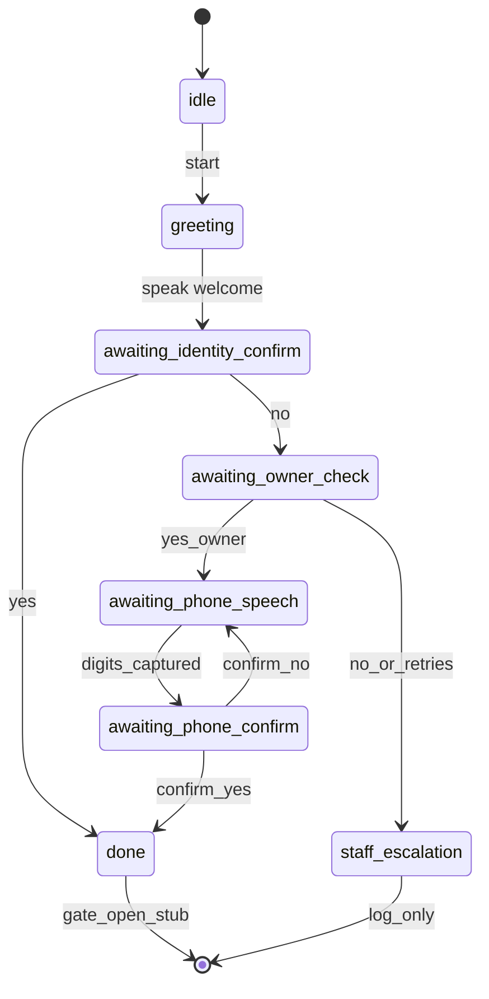

# *Kiosk Voice Pipeline — Phase 1 Plan*

## *Scope*

*Implement only the **kiosk-side voice pipeline** for Toyota Smart Gate, matching your prompt and [toyota-gate-queue-system-design.md](toyota-gate-queue-system-design.md) §2 (avatar flow). Out of scope: SAB/SAP, queue engine, gate controller, cloud TTS/STT, LLMs, streaming STT.*

***Process gate:** After **Stage 1** completes and is proven, stop. Continue to Stage 2/3/4 only when you explicitly say the prior stage is OK. Same hard stop after each later stage.*

## *Multi-gate readiness (one gate now)*

*Phase 1 runs a **single physical kiosk**, but the server will not bake in “there is only ever one conversation.”*

- *Every conversation is a **session** keyed by* `session_id`*, with a required* `gate_id` *(default* `"gate-1"` *in config / UI).*
- *State machine instances are **per session**, not a process-global singleton — so N concurrent kiosks later share one LAN server without colliding.*
- *Fake client profile and “gate open” stub include* `gate_id` *in logs/responses.*
- *No MQTT / WebSocket / middleware yet — just clean session isolation and* `gate_id` *on the conversation API so scaling is additive later.*




## *Stack choices (locked)*


| *Piece*      | *Choice*                                                                                         | *Why*                                                                                                                                                                                          |
| ------------ | ------------------------------------------------------------------------------------------------ | ---------------------------------------------------------------------------------------------------------------------------------------------------------------------------------------------- |
| *Language*   | ***Python + FastAPI***                                                                           | *Piper and faster-whisper are native Python; one process wires all endpoints*                                                                                                                  |
| *TTS*        | `pip install piper-tts` *(OHF-Voice /* `piper1-gpl`*) +* `en_US-lessac-medium`                   | *Spec requirement; CLI-first proof*                                                                                                                                                            |
| *STT*        | `faster-whisper` *model* `**base*`* *(CPU or CUDA if available)*                                 | *Spec start size; RTX 5050 present — use GPU if install succeeds, else CPU; bump to* `small`*/*`medium` *only if digit STT fails*                                                              |
| *Avatar*     | ***Rive** with* `mouthOpen` *+ idle/talking/listening; Lottie only if Rive asset/runtime blocks* | *Spec primary*                                                                                                                                                                                 |
| *Python env* | *venv under* `kiosk-voice/.venv`                                                                 | *System is Python **3.14**; try it first. If* `onnxruntime` */* `ctranslate2` *wheels fail, install **Python 3.12** (e.g. via* `uv` *or deadsnakes) and recreate the venv — do not fight 3.14* |
| *Layout*     | *New tree* `[kiosk-voice/](kiosk-voice/)` *per prompt; leave empty* `[tts/](tts/)` *alone*       | *Spec structure*                                                                                                                                                                               |


*Also save the full prompt as* `[kiosk-voice/cursor-agent-prompt.md](kiosk-voice/cursor-agent-prompt.md)` *so* `PROGRESS.md` *can reference it.*

## *Directory layout*

```
kiosk-voice/
  cursor-agent-prompt.md
  PROGRESS.md          # status table + append-only stage log
  README.md
  requirements.txt
  server/
    app.py             # FastAPI: /tts, /stt, /session/*, static UI
    tts.py
    stt.py
    state_machine.py
    normalize.py       # yes/no + phone digit helpers (Stage 2+)
  voices/
    en_US-lessac-medium.onnx
    en_US-lessac-medium.onnx.json   # Piper config sidecar
  kiosk-ui/
    index.html
    avatar.js          # Stage 4
    app.js             # Stage 3+ UI ↔ session API
```

## *Stage 1 — TTS only (implement first, then stop)*

1. *Scaffold* `kiosk-voice/`*,* `PROGRESS.md` *(header + status table),* `README.md`*,* `requirements.txt`*, venv.*
2. *Install Piper; download Lessac medium voice from Hugging Face Piper voices into* `voices/`*.*
3. ***CLI proof** (mandatory before API): e.g.* `echo "Welcome to Toyota" | piper ... > /tmp/out.wav` *and play/inspect with* `ffplay`*/*`ffprobe`*. Log exact command + result in* `PROGRESS.md`*.*
4. `tts.py`*: load model once; synthesize text → WAV bytes.*
5. `app.py`*:* `POST /tts` *body* `{ "text": "..." }` *→* `audio/wav`*; CORS for local UI; serve* `kiosk-ui/` *statically.*
6. *Minimal* `kiosk-ui/index.html`*: textarea + Speak button →* `/tts` *→* `<audio>`*.*
7. *Update* `PROGRESS.md` *status table: Stage 1 ✅. **Stop for your confirmation.***

## *Stage 2 — STT only (after Stage 1 OK)*

1. *Install* `faster-whisper`*; load* `base` *once at startup.*
2. `POST /stt`*: multipart audio upload →* `{ "text": "...", "normalized": "yes"|"no"|"digits"|null, "digits": "..."|null }`*.*
3. `normalize.py`*: map yeah/yep/yup/nah/nope → yes/no; strip non-digits for phone candidates.*
4. *UI: MediaRecorder record → upload (file-based, **not** streaming).*
5. *Prove with recorded clips + curl. Mark Stage 2 ✅; **stop**.*

## *Stage 3 — State machine glue (after Stage 2 OK)*

1. `state_machine.py` *with states:* `idle`*,* `greeting`*,* `awaiting_identity_confirm`*,* `awaiting_owner_check`*,* `awaiting_phone_speech`*,* `awaiting_phone_confirm`*,* `done`*,* `staff_escalation`*.*
2. *Hardcoded fake profile, e.g.* `{ name, phone, plate, gate_id }`*.*
3. *Session API (no new external deps):*
  - `POST /session/start` **`{ gate_id? }` *→ create session, enter* `greeting`*, return prompts + TTS text*
  - `POST /session/{id}/input` **`{ source: "stt"|"touch", text? | choice?: "yes"|"no", phone_digits? }` *→ transition, retry counts (cap 3 →* `staff_escalation`*), return next prompt /* `gate_open_stub` */ escalation*
4. *Wire UI to call* `/tts` *for spoken prompts and* `/stt` *or touch buttons/keypad for answers.*
5. *Prove full flow via curl/Postman **text-only** (no avatar yet). Mark Stage 3 ✅; **stop**.*

*Flow (matches your prompt):*




## *Stage 4 — Avatar + lip sync (after Stage 3 OK)*

1. *Add Rive character (or Lottie fallback) with* `mouthOpen` *and visual states idle / talking / listening.*
2. *On TTS playback: Web Audio* `AnalyserNode` *→ amplitude →* `mouthOpen`*.*
3. *Map state machine states → avatar visual states.*
4. *End-to-end demo on the kiosk page. Mark Stage 4 ✅.*

## *Documentation (every stage)*

- *Append* `PROGRESS.md` *entries in the exact format from the prompt after each meaningful unit of work.*
- *Refresh the top status table at stage boundaries.*
- *After any file-changing work, also append to repo-root* `[releases.md](releases.md)` *per workspace rule (separate from* `PROGRESS.md`*).*

## *Explicit non-goals this phase*

*No SAB lookup, queue, gate hardware, LLM, cloud speech APIs, or streaming STT. Multi-gate **runtime** (MQTT, Socket.io middleware fan-out) stays future work — only session/*`gate_id` *scaffolding lands now.*