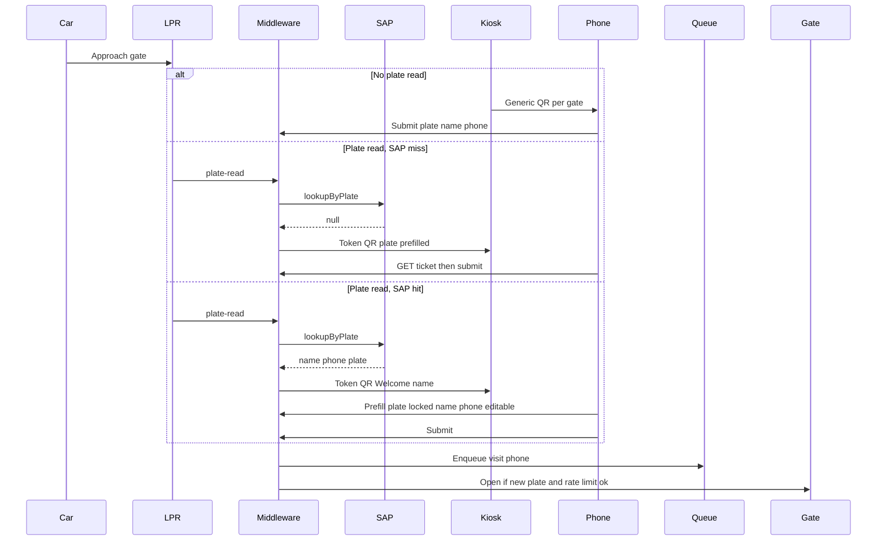

# QR check-in (replace kiosk voice)

Grilling settled this flow. Implementation is new — there is no QR/form/token code today. Voice TTS/STT/NLU stays in the middleware unused; the kiosk UI becomes QR + status only.

## The new flow

**Path A — generic QR** (always on, printed or kiosk idle): `https://{public}/checkin?gate={gateId}`. Empty form. Customer types plate, name, phone. Submit → queue + open **that** gate.

**Path B — LPR + SAP miss:** Kiosk swaps to a token URL. Form prefills **plate only** (editable). Name and phone empty.

**Path C — LPR + SAP hit:** Kiosk shows `Welcome, {name}` + QR (no phone on the glass). Token URL. Form prefills plate (**locked**), name, phone (editable). One Submit.

Token is **opaque** (random id in Redis). PII never sits in the QR. The phone loads `/checkin?gate=…&t=…`, then `GET` the ticket over HTTPS.

After enqueue, slot-free → WhatsApp/SMS/app claim is **unchanged**.

## Settled rules

- Gate opens on **successful new-plate submit**, not on LPR. You accepted that a printed generic QR can open the barrier from the street.
- Mitigation: **at most one gate-open per gate per ~30s**. Extra *new* plates still enqueue; they just do not fire another open until the window passes.
- Duplicate plate already waiting: **409**, no second entry, **do not** open again.
- Edited name/phone are **visit-only**. No SAP write-back.
- Token TTL **3 minutes**, **single use**, bound to `gateId` + plate. Kiosk reverts to generic QR on expiry or after submit.
- Expired/used token: drop into the generic form for that gate; keep plate prefilled if LPR is still live.
- Car data = **plate** (`ClientProfile` is only name/phone/plate).
- Surfaces: public mobile form + kiosk QR screen + demo console.

## Backend

New module [`middleware/src/modules/check-in/`](middleware/src/modules/check-in/) (Redis ticket store + controller + service).

**Ticket (Redis, TTL 180s)**

- `token`, `gateId`, `plateNumber`, `name`, `phone`, `plateLocked`, `source: sap | lpr | generic`
- Keys: `checkin:ticket:{token}`, `checkin:gate:{gateId}` (current ticket for the kiosk), `checkin:gate:open:{gateId}` (SET NX EX 30)

**Mint tickets from existing SAP events** — change [`kiosk.service.ts`](middleware/src/modules/kiosk/kiosk.service.ts) so it no longer starts the voice FSM:

- `sap.lookup.found` → mint SAP ticket (`plateLocked: true`, name+phone filled) → push kiosk display. Keep plate active with a short `checkin_pending` TTL (~180s), not the old 1h `kiosk_session`.
- `sap.lookup.not_found` → **do not** `clearActive` and **do not** show “not recognized”. Mint LPR ticket (`plateLocked: false`, plate only) → push kiosk display.

**HTTP** (CORS already allows the Next origin)

- `GET /checkin/tickets/:token` — prefill payload, or 410 if missing/used/expired
- `POST /checkin/submit` — `{ token?, gateId, plateNumber, name, phone }`
  - If token + `plateLocked`, ignore client plate and use ticket plate
  - Validate required fields
  - Call extracted `QueueEngineService.enqueueVisit(...)` (today private, triggered only by [`kiosk.identity.confirmed`](middleware/src/modules/queue-engine/queue-engine.service.ts) / `kiosk.phone.captured`)
  - If `created === false` → 409 already queued, skip gate
  - If created → emit `checkin.submitted` → `GateService.openForVisit` only if rate-limit key is acquired
- `GET /checkin/display/:gateId` — current kiosk view (generic URL vs token URL + name)

**Events** in [`domain-events.ts`](middleware/src/events/domain-events.ts): add `CheckinSubmitted`. Point [`gate.service.ts`](middleware/src/modules/gate/gate.service.ts) and queue enqueue at this (stop using kiosk confirm as the live trigger). Keep old kiosk event names in the file so unused voice code still compiles.

**Env:** `CHECKIN_PUBLIC_BASE_URL` (absolute link phones can open, not `localhost` in a real lane) and `CHECKIN_TOKEN_TTL_SECONDS=180`, `GATE_OPEN_RATE_LIMIT_SECONDS=30`.

**Kiosk socket** in [`kiosk.gateway.ts`](middleware/src/modules/kiosk/kiosk.gateway.ts): on `kiosk.join`, push `checkin.display` `{ mode, gateId, checkinUrl, customerName?, expiresAt }`. Idle = generic `?gate=` URL.

## Frontend

**Public form** — new [`web/app/checkin/page.tsx`](web/app/checkin/page.tsx) + `web/features/checkin/CheckinForm.tsx` (mobile-first, Al Sayer tokens, not the kiosk HUD).

- No token: blank plate/name/phone, `gateId` from query (hidden, not editable)
- Valid token: prefill; lock plate when `plateLocked`
- 410 token: same as generic, plate prefilled if the API says LPR is still live
- Submit success: “You’re in the queue. Barrier opening.” / already-queued copy
- Phone talks to middleware (`createMwApi`), not Next server actions

**Kiosk** — rewrite [`web/features/kiosk/KioskApp.tsx`](web/features/kiosk/KioskApp.tsx): drop avatar/yes-no/keypad/mic. Show large QR (`qrcode` on the client from `checkinUrl`), Welcome name on SAP mode, status when submitted. Keep gate id + middleware URL + links to console/logs.

**Console** — [`web/features/console/ConsoleApp.tsx`](web/features/console/ConsoleApp.tsx): after simulated LPR, show the live check-in URL/QR and a button to open `/checkin?…` instead of driving the avatar. Queue + slot-free + WhatsApp confirm stay.

## Tests / demo

- Unit: ticket mint/TTL/single-use, plate lock, 409 duplicate, gate rate limit vs still-enqueue
- Adjust [`middleware/scripts/prove_flow.sh`](middleware/scripts/prove_flow.sh) (or equivalent) from kiosk input → `POST /checkin/submit`
- Manual: console Save SAP → Send plate → kiosk shows named QR → phone form prefilled → submit → queue row → slot free still notifies
