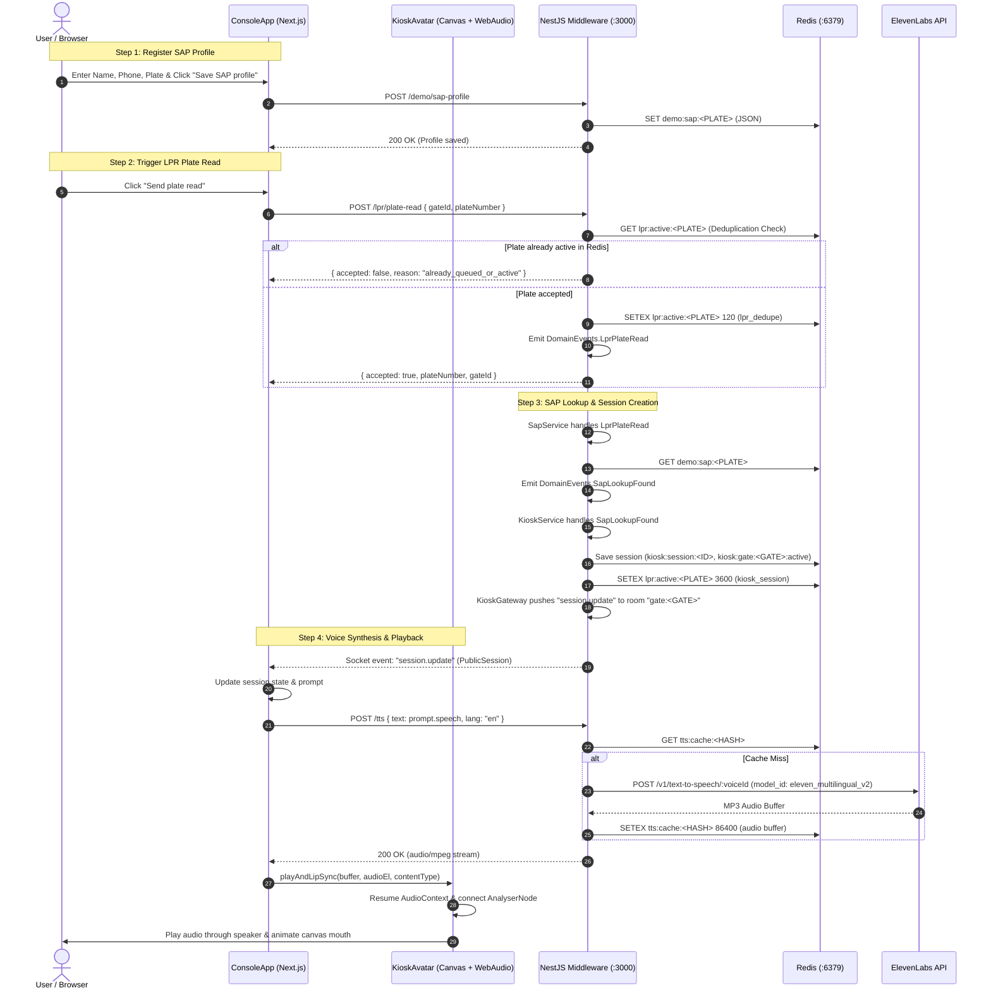

# Voice and Session Flow Architecture & Fix Plan

## 1. End-to-End Flow Trace

The diagram below illustrates the complete architecture and runtime flow from SAP profile registration and LPR plate ingestion to ElevenLabs voice synthesis and browser playback.

---

## 2. Root Cause Analysis

1. **Invalid ElevenLabs Model IDs in Environment & Validation Schema**:
   - `[middleware/.env](middleware/.env)` configured `ELEVENLABS_TTS_MODEL_ID=eleven_v3` and `ELEVENLABS_STT_MODEL_ID=scribe_v2`.
   - `eleven_v3` and `scribe_v2` do not exist in ElevenLabs public API. ElevenLabs returns `HTTP 400 (invalid_model_id)` after 4 retry attempts with exponential backoff.
   - `[middleware/src/config/env.validation.ts](middleware/src/config/env.validation.ts)` and `[middleware/.env.example](middleware/.env.example)` also had default `eleven_v3` and `scribe_v2`.
   - Valid ElevenLabs models are `eleven_multilingual_v2` (or `eleven_turbo_v2_5`) for TTS, and `scribe_v1` for STT.

2. **Duplicate and Broken Environment Config**:
   - `[middleware/.env](middleware/.env)` has duplicate `CORS_ORIGINS` definitions.
   - TTS failure cascades to `speakText` in `[web/features/console/ConsoleApp.tsx](web/features/console/ConsoleApp.tsx)`, setting `TTS error: ...` on `sessionStatus` and preventing the avatar from speaking.

3. **Missing Active Session Sync on Socket Join**:
   - In `[middleware/src/modules/kiosk/kiosk.gateway.ts](middleware/src/modules/kiosk/kiosk.gateway.ts)`, when `kiosk.join` is received, it only returns and emits `checkin.display`, but does not emit existing active `session.update` for the gate. If a user connects or refreshes after a session starts, the session UI remains blank.

4. **LPR Plate Active Lock Handling**:
   - When testing repeatedly without clicking "Reset demo run", `LprService` rejects subsequent plate reads with `already_queued_or_active`. Adding a clear option or auto-clearing stale dedupe on explicit manual demo test ensures smooth testing.

5. **Browser Autoplay & Audio Graph Robustness**:
   - In `[web/components/avatar/KioskAvatar.tsx](web/components/avatar/KioskAvatar.tsx)`, audio errors or autoplay policy rejections need explicit catch/cleanup to prevent animation frame leaks or silent UI locks.

---

## 3. Proposed Fixes

### 1. Update Middleware Configuration & Validation
- Edit `[middleware/.env](middleware/.env)`:
  - Set `ELEVENLABS_TTS_MODEL_ID=eleven_multilingual_v2`
  - Set `ELEVENLABS_STT_MODEL_ID=scribe_v1`
  - Clean up duplicate `CORS_ORIGINS` line
- Edit `[middleware/src/config/env.validation.ts](middleware/src/config/env.validation.ts)`:
  - Update defaults for `ELEVENLABS_TTS_MODEL_ID` to `eleven_multilingual_v2` and `ELEVENLABS_STT_MODEL_ID` to `scribe_v1`.
- Edit `[middleware/.env.example](middleware/.env.example)`:
  - Update model IDs to match valid ElevenLabs endpoints.

### 2. Improve Gateway Session Synchronization
- In `[middleware/src/modules/kiosk/kiosk.gateway.ts](middleware/src/modules/kiosk/kiosk.gateway.ts)`:
  - On `kiosk.join`, check `this.kioskService.getSession` / `store.getActiveForGate(gateId)`.
  - Emit `session.update` if an active session exists so the client immediately displays the visit session.

### 3. Enhance Frontend Console Voice & Session Handling
- In `[web/features/console/ConsoleApp.tsx](web/features/console/ConsoleApp.tsx)`:
  - Provide clear status feedback when TTS is generating vs playing.
  - Add explicit audio context resume on user clicks (Connect / Save SAP / Send Plate Read).
  - Handle plate read rejection gracefully with a quick "Reset & retry" action if `already_queued_or_active` is returned.
- In `[web/components/avatar/KioskAvatar.tsx](web/components/avatar/KioskAvatar.tsx)`:
  - Add error listeners and promise rejection safety to `playAndLipSync` to prevent hanging promises on audio decoding or autoplay failures.

---

## 4. Verification Plan

1. Verify environment schema and compilation: run NestJS and Next.js builds.
2. Test `/tts` endpoint directly via HTTP POST with `text` and `lang` to confirm ElevenLabs returns valid audio buffer.
3. Test full browser flow:
   - Save SAP profile for "Mahmoud Mater" (`TKN 9001`).
   - Click "Send plate read".
   - Verify `DomainEvents.LprPlateRead` -> `SapLookupFound` -> `KioskSessionStarted` -> `session.update` socket event.
   - Verify avatar receives audio, plays voice via ElevenLabs TTS, and animates mouth lip sync on the canvas.
   - Click "Yes" / "No" or use "Hold to speak" for STT.