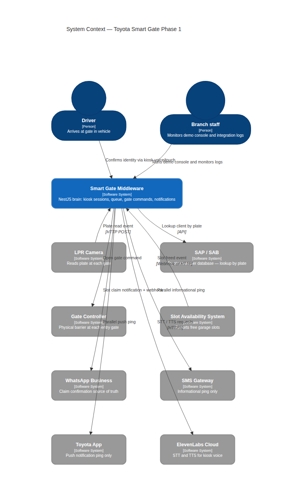
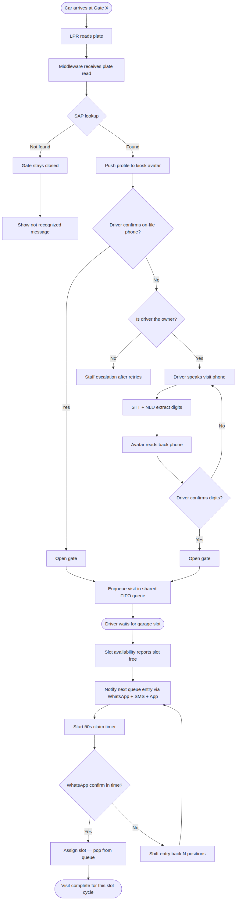
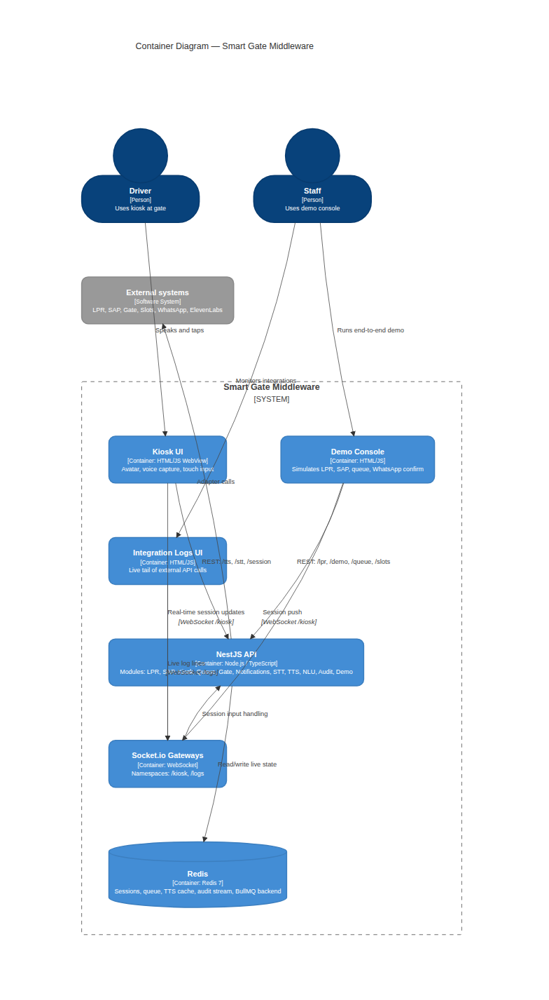
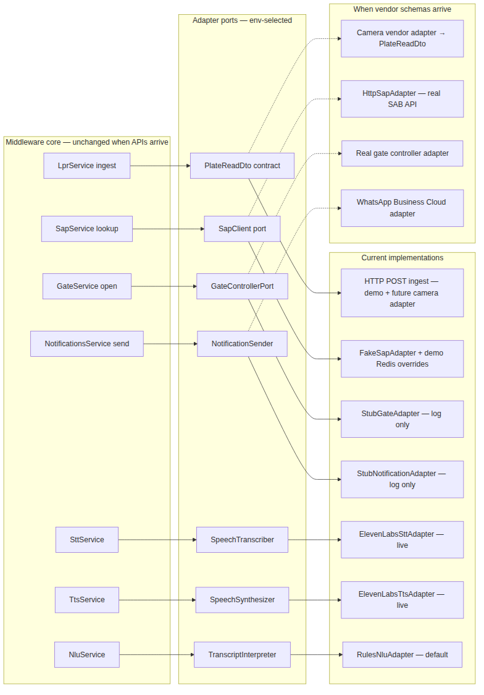
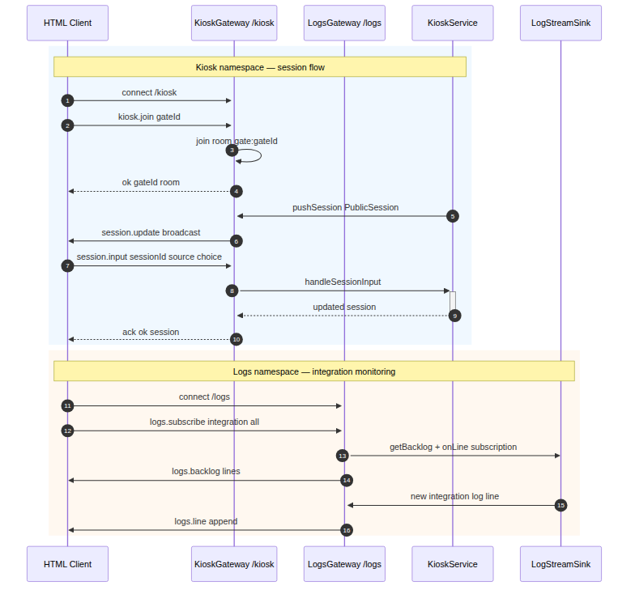
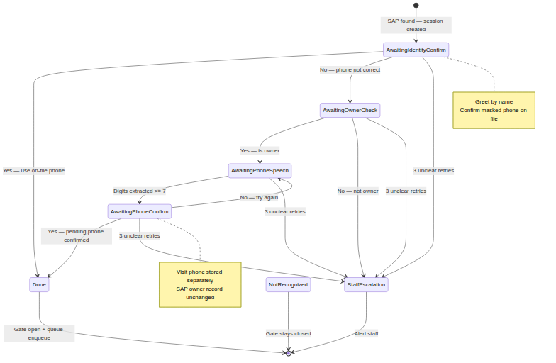
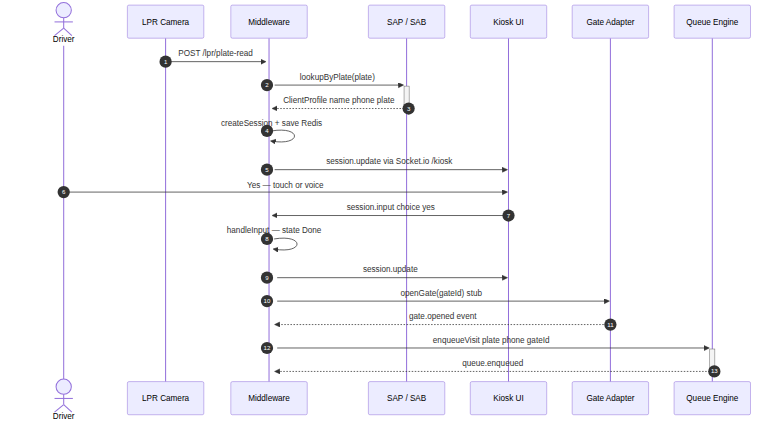
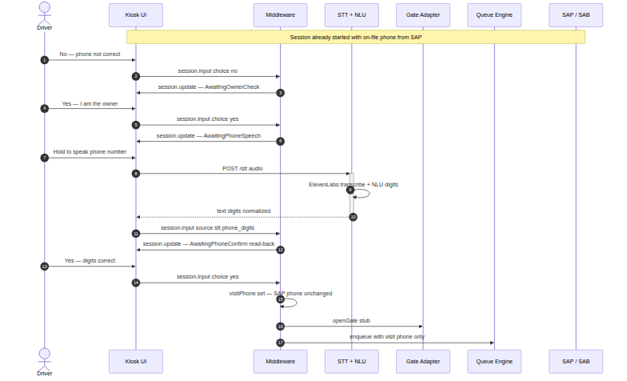
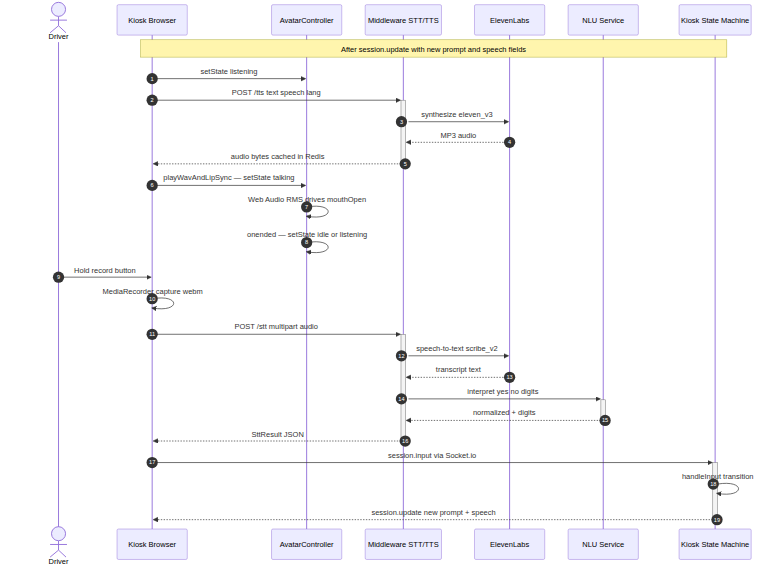
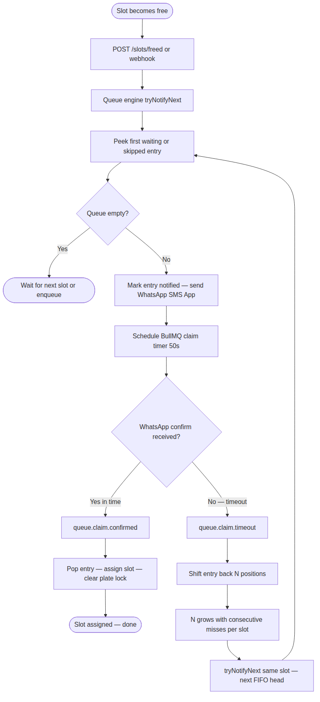

# Toyota Smart Gate & Queue — Technical Handover

**Document type:** Client technical handover  
**Project:** Tamkeen Phase 1 — Kiosk AI Agent & Queue Management  
**Audience:** Client technical team (CTO office, integration engineers)  
**Date:** August 2026  
**Prepared by:** Tamkeen development team

---

## Table of contents

1. [Executive summary](#1-executive-summary)
2. [What we are building](#2-what-we-are-building)
3. [What has been delivered](#3-what-has-been-delivered)
4. [Architecture overview](#4-architecture-overview)
5. [Design patterns — adapter ports](#5-design-patterns--adapter-ports)
6. [Web UIs](#6-web-uis)
7. [Real-time communication — Socket.io](#7-real-time-communication--socketio)
8. [Kiosk conversation approach](#8-kiosk-conversation-approach)
9. [Voice pipeline — STT, NLU, TTS, avatar sync](#9-voice-pipeline--stt-nlu-tts-avatar-sync)
10. [Queue engine](#10-queue-engine)
11. [Integrations status](#11-integrations-status)
12. [HTTP API reference](#12-http-api-reference)
13. [Environment variables](#13-environment-variables)
14. [Domain events](#14-domain-events)
15. [How to run and demo](#15-how-to-run-and-demo)
16. [Not yet production-ready](#16-not-yet-production-ready)
17. [Open questions for the client](#17-open-questions-for-the-client)

---

## 1. Executive summary

### The problem

At a Toyota service branch, cars queue at entry gates while staff manually verify identity. Plate recognition exists, but there is no conversational confirmation with the driver. Garage slot availability is opaque — drivers enter without knowing when a slot will free up, and no-shows waste capacity.

### The solution

**Two modules, one middleware brain:**

| Module | Role |
|--------|------|
| **Module 1 — Kiosk AI Agent** | Voice avatar at each gate confirms identity after LPR + SAP lookup, captures a visit phone when the driver is not the account holder, opens the gate, and enqueues the visit |
| **Module 2 — Queue Management** | Single shared FIFO queue across all gates; when a garage slot frees, notify the next driver via WhatsApp (authoritative), SMS, and app push, with a **50-second claim window** and **growing push-back** on no-shows |

### Phase 1 scope

- **In scope:** Single branch, multiple entry gates, one shared queue, entry flow only
- **Out of scope:** Exit flow, multi-branch scale, Arabic voice (scaffolded but disabled), production hardware integrations not yet contracted

### What this delivery includes

A **demo-ready NestJS middleware prototype** with:

- Full kiosk session state machine (voice + touch)
- Shared queue engine with BullMQ claim timers
- Three browser UIs (kiosk, demo console, integration logs)
- ElevenLabs STT/TTS integration (live)
- Stub adapters for SAP, gate, and WhatsApp so local development proceeds before vendor API schemas arrive
- End-to-end proof script and unit tests



---

## 2. What we are building

### System actors

| Actor / system | Role |
|----------------|------|
| **LPR camera** (one per gate) | Reads plate as car approaches; sends plate to middleware |
| **Kiosk / avatar** (one per gate) | Voice-driven UI; displays client info, asks for confirmation |
| **Gate controller** | Physical barrier; opens on middleware command |
| **Middleware** | Central brain — orchestrates all gates, owns the queue, drives notifications |
| **SAP / SAB** | Toyota customer database — lookup by plate (read-only from middleware) |
| **Slot availability system** | Reports when garage slots become free |
| **Notification service** | WhatsApp (claim source of truth), SMS, Toyota app push (informational) |

### Business rules (resolved)

| Rule | Behaviour |
|------|-----------|
| Plate **not found** in SAP | Gate stays **closed** — no guest flow |
| SAP / middleware **unreachable** | Gate stays **closed** |
| Driver says phone on file is **wrong** | Ask if owner; if yes, collect visit phone by voice; **visit phone does not overwrite SAP record** |
| **WhatsApp confirm** within 50s | Slot assigned; confirmation treated as guaranteed arrival |
| **Timeout** on claim | Entry pushed back N positions (N grows with consecutive misses); next FIFO head notified |
| **Retry ceiling** on queue | None — client cycles indefinitely if they keep missing notifications |
| **Staff escalation** | After 3 unclear retries in kiosk conversation |



---

## 3. What has been delivered

Work completed August 9–11, 2026 (see [`releases.md`](../../releases.md) for full changelog).

### A. Middleware core

- NestJS modular monolith: LPR, SAP, Gate, Kiosk, Queue Engine, Notifications, Audit, Demo, TTS, STT, NLU, Integration Log
- Redis for live state (sessions, queue, TTS cache, audit stream, LPR dedupe)
- BullMQ delayed jobs for 50s claim timers
- Domain event bus (`@nestjs/event-emitter`) with typed payloads and audit trail
- Correlation IDs via `x-correlation-id` header

### B. Kiosk session engine

- Explicit state machine — not a free-form LLM conversational agent
- States: identity confirm → owner check → phone speech → phone confirm → done / staff escalation / not recognized
- Bilingual i18n scaffolding (English active; Arabic disabled via `ARABIC_ENABLED=false`)
- Display text vs ElevenLabs speech strings split (`prompt` vs `speech` in session payload)
- Al-Sayer Hayyak branding in kiosk copy

### C. Queue engine

- Redis FIFO list with atomic Lua scripts for enqueue, shift-back, and assign
- Growing push-back on consecutive no-shows per slot cycle
- Multi-slot parallel notify via batch free endpoint
- WhatsApp confirm HTTP endpoint (stub notification adapter for demos)

### D. Voice stack (ElevenLabs)

- STT via ElevenLabs Scribe (`scribe_v2`)
- TTS via ElevenLabs v3 (`eleven_v3`) with audio tags and 3-3-4 digit read-out
- Redis TTS cache (SHA256 of voice+model+text)
- Retry with exponential backoff on ElevenLabs 429/5xx
- Stub adapters for offline demo without API key

### E. NLU (transcript interpretation)

- Rules-first hybrid: yes/no and clean phone digits handled instantly
- Optional local LLM (Ollama `qwen3:0.6b`) for messy digit speech only
- 2s fail-fast timeout; falls back to rules
- EG/SA phone validation
- Read-back confirm step is the accuracy safety net

### F. Web UIs

- **Kiosk** (`index.html`) — avatar, voice capture, touch keypad, STT/TTS sandbox
- **Demo console** (`console.html`) — full operator workflow with audit timeline
- **Integration logs** (`logs.html`) — live tail of external API calls

### G. Integration logging

- Structured logging for ElevenLabs, LPR, NLU, SAP, gate, notifications, TTS, STT
- File sink (rotating logs under `middleware/logs/`) + live WebSocket viewer
- Redaction of API keys and long bodies

### H. Tests and proof

- Unit tests: state machine, queue logic, TTS/STT/NLU specs (19+ tests)
- `scripts/prove_flow.sh` — curl-based end-to-end proof without browser

---

## 4. Architecture overview

The middleware is a **modular monolith**: one Node.js process serves REST, WebSocket, and static HTML. Modules communicate via **domain events** rather than direct tight coupling.



### NestJS modules

| Module | Responsibility |
|--------|----------------|
| `lpr` | Ingest plate reads, dedupe active plates, emit `lpr.plate.read` |
| `sap` | Lookup client profile by plate on LPR event |
| `kiosk` | Session state machine, Redis store, Socket.io push |
| `gate` | Open gate on identity/phone confirmed |
| `queue-engine` | FIFO queue, slot notify, claim timers, shift-back |
| `notifications` | Send slot notifications; WhatsApp confirm endpoint |
| `audit` | Append all domain events to Redis stream |
| `demo` | Fake SAP overrides, full reset, config |
| `tts` / `stt` / `nlu` / `speech` | Voice pipeline with adapter seams |
| `integration-log` | Pretty file logs + live WebSocket viewer |

### Data stores

| Store | Contents |
|-------|----------|
| **Redis** | Kiosk sessions, queue entries, LPR active-plate keys, TTS cache, audit stream, BullMQ backend |
| **Postgres** | Not implemented in this phase (design doc recommends it for durable audit history) |

---

## 5. Design patterns — adapter ports

External integrations use the **hexagonal / ports-and-adapters** pattern. Each integration has a TypeScript interface (port) and one or more implementations selected by environment variable. **Stub adapters exist so development and demos proceed locally until the actual vendor API schemas are delivered.**



### LPR — ingest contract (not a full adapter yet)

LPR uses a stable **ingest DTO** today. When the camera vendor API schema arrives, a thin adapter maps vendor payloads into this contract without changing kiosk or queue logic.

```typescript
// POST /lpr/plate-read
{ gateId, plateNumber, timestamp?, image? }
```

### SAP / SAB — customer lookup

| | |
|--|--|
| **Port** | `SapClient.lookupByPlate(plate) → ClientProfile \| null` |
| **Today** | `FakeSapAdapter` — hardcoded `ABC 1234` + Redis demo overrides via `POST /demo/sap-profile` |
| **Future** | `SAP_ADAPTER=http` with real SAB API (reserved; throws at startup until implemented) |

### Gate controller

| | |
|--|--|
| **Port** | `GateControllerPort.openGate(gateId)` |
| **Today** | `StubGateAdapter` — logs `gate.open.stub`, no physical action |
| **Future** | `GATE_ADAPTER=real` (reserved; throws at startup until implemented) |

### WhatsApp / notifications

| | |
|--|--|
| **Port** | `NotificationSender.notify({ entryId, phone, plateNumber, slotId, channels })` |
| **Today** | `StubNotificationAdapter` — logs notification; confirm simulated via `POST /notifications/whatsapp/confirm` |
| **Future** | `NOTIFICATION_ADAPTER=real` — WhatsApp Business Cloud API + webhook (reserved) |

**Important:** Only WhatsApp confirmation counts for queue logic. SMS and app push are parallel informational pings.

### STT / TTS / NLU

| Port | Live implementation | Stub |
|------|---------------------|------|
| `SpeechTranscriber` | `ElevenLabsSttAdapter` | `StubSttAdapter` (returns `"yes"`) |
| `SpeechSynthesizer` | `ElevenLabsTtsAdapter` | `StubTtsAdapter` (silent WAV) |
| `TranscriptInterpreter` | `RulesNluAdapter` (default) | `LlmNluAdapter` (Ollama, optional) |

Env vars: `STT_ADAPTER`, `TTS_ADAPTER`, `NLU_ADAPTER`.

---

## 6. Web UIs

All UIs are **thin HTML/JavaScript clients** served from `middleware/public/` via NestJS `ServeStaticModule`. **All session logic lives on the server** — the browser handles presentation, TTS playback, STT capture, and Socket.io transport only.

### 6.1 Regular kiosk UI

| File | Role |
|------|------|
| `index.html` | Kiosk layout — avatar panel, session controls, STT/TTS sandboxes |
| `app.js` | Socket.io connect, session render, hold-to-speak, touch input |
| `avatar.js` | Avatar states (idle/talking/listening), canvas or Rive lip-sync from TTS audio RMS |

**URL:** http://127.0.0.1:3000/

Features: Start manual visit, Yes/No buttons, hold-to-record voice answers, phone keypad, TTS/STT test panels.

### 6.2 Demo console

| File | Role |
|------|------|
| `console.html` | Operator layout — connection, SAP profile, LPR simulate, queue, slots |
| `console.js` | Demo workflow orchestration, audit timeline polling |
| `mw-api.js` | Shared HTTP + Socket.io API wrapper with localStorage config |

**URL:** http://127.0.0.1:3000/console.html

Operator workflow: Connect → Save SAP profile → Send LPR plate → interact with avatar → Free slot → WhatsApp confirm → watch audit timeline.

### 6.3 Integration logs UI

| File | Role |
|------|------|
| `logs.html` | Filterable live log viewer |
| `logs.js` | Socket.io `/logs` subscribe, append lines |

**URL:** http://127.0.0.1:3000/logs.html

Tracks: `elevenlabs`, `lpr`, `nlu`, `sap`, `gate`, `notifications`, `tts`, `stt`.

### UI design approach

- **Server-driven prompts:** Each `session.update` carries `prompt` (screen text) and `speech` (ElevenLabs-optimized text with audio tags and spelled digits)
- **Avatar sync:** Server sets `avatar_state`; client drives lip-sync during TTS playback via Web Audio API amplitude analysis
- **Degraded fallback:** Touch keypad and Yes/No buttons work when STT fails or ElevenLabs is unavailable (with stub adapters)

---

## 7. Real-time communication — Socket.io

HTML clients connect to the **same origin** as the NestJS API (port 3000). Two WebSocket namespaces are used.



### Namespace `/kiosk` — session flow

| Direction | Event | Payload | Notes |
|-----------|-------|---------|-------|
| Client → Server | `kiosk.join` | `{ gateId }` | Joins room `gate:{gateId}` |
| Server → Client | `session.update` | `PublicSession` | Broadcast to gate room |
| Client → Server | `session.input` | `{ sessionId, source, choice?, text?, phone_digits? }` | Ack returns `{ ok, session }` |

**REST fallback:** `POST /session/:sessionId/input` when socket is disconnected.

### Namespace `/logs` — integration monitoring

| Direction | Event | Payload |
|-----------|-------|---------|
| Client → Server | `logs.subscribe` | `{ integration: 'all' \| 'elevenlabs' \| ... }` |
| Server → Client | `logs.backlog` | Initial buffered lines |
| Server → Client | `logs.line` | New log line (live tail) |

### PublicSession payload (key fields)

| Field | Description |
|-------|-------------|
| `session_id`, `gate_id`, `state`, `lang` | Session identity |
| `profile.name`, `profile.phone_display` | Masked phone (e.g. `050-XXX-4567`) |
| `prompt`, `speech` | Display vs TTS text |
| `avatar_state` | `idle` / `talking` / `listening` |
| `retries`, `max_retries` | Retry counter (max 3) |
| `gate_open_stub` | Whether gate stub fired |

---

## 8. Kiosk conversation approach

The kiosk uses an **explicit server-side state machine** — not a free-form LLM agent. NLU only extracts yes/no and phone digits from STT transcripts; the state machine decides what to ask next.



### States

| State | Meaning |
|-------|---------|
| `awaiting_identity_confirm` | Greet by name; confirm masked phone on file |
| `awaiting_owner_check` | Driver said phone wrong — are you the owner? |
| `awaiting_phone_speech` | Owner speaks alternate visit phone |
| `awaiting_phone_confirm` | Read back heard digits; confirm |
| `done` | Visit complete — gate open + enqueue |
| `staff_escalation` | Max retries or not owner |
| `not_recognized` | SAP lookup failed — gate stays closed |

### Known customer — happy path



1. LPR sends plate → SAP returns profile
2. Middleware creates session → pushes to kiosk via Socket.io
3. Avatar greets and asks to confirm phone
4. Driver says **Yes** (voice or touch)
5. Gate stub opens → visit enqueued with on-file phone

### Driver not owner — visit phone capture



1. Driver says phone on file is **wrong**
2. Avatar asks: are you the owner?
3. If **yes** → driver speaks visit phone → STT + NLU extract digits
4. Avatar reads back digits → driver confirms
5. Gate opens → enqueued with **visit phone only** — SAP owner record unchanged

### i18n and branding

- Copy uses **Al-Sayer Hayyak** brand voice
- `display` strings are clean screen text; `speech` strings include ElevenLabs v3 audio tags (`[warmly]`, pauses) and spelled-out phone digits (3-3-4 pattern)
- Arabic translations exist in code but are disabled (`ARABIC_ENABLED=false`); language picker hidden in UI

---

## 9. Voice pipeline — STT, NLU, TTS, avatar sync



### Flow (one voice answer turn)

1. Server pushes `session.update` with `speech` field
2. Client calls `POST /tts` with `{ text: speech, lang }` → ElevenLabs returns MP3 (cached in Redis)
3. `AvatarController.playWavAndLipSync()` — Web Audio RMS drives mouth openness
4. Driver holds record button → `MediaRecorder` captures audio
5. Client calls `POST /stt` (multipart `audio` + `lang`)
6. Middleware: ElevenLabs transcribe → `NluService.interpret()` → `{ text, normalized, digits }`
7. Client sends `session.input` via Socket.io
8. State machine transitions → new `session.update` → repeat from step 1

### ElevenLabs configuration

| Setting | Default | Purpose |
|---------|---------|---------|
| `ELEVENLABS_STT_MODEL_ID` | `scribe_v2` | Speech-to-text |
| `ELEVENLABS_TTS_MODEL_ID` | `eleven_v3` | Text-to-speech (required for audio tags) |
| `ELEVENLABS_TTS_VOICE_ID` | — | Voice selection (required for live TTS) |
| `ELEVENLABS_TTS_OUTPUT_FORMAT` | `mp3_44100_128` | Audio format |
| `TTS_CACHE_TTL_SECONDS` | `86400` | Redis cache TTL |

**Note:** Live ElevenLabs requires outbound internet from the kiosk/middleware host. Use `TTS_ADAPTER=stub` / `STT_ADAPTER=stub` for air-gapped demos; touch input remains available.

### NLU strategy (latency-first)

1. Rules normalize yes/no and extract digits instantly
2. Pure yes/no (no long digit run) → return immediately — no LLM call
3. Clean valid EG/SA phone from rules → skip LLM
4. If `NLU_ADAPTER=llm` and speech is ambiguous → call Ollama with 2s timeout
5. LLM timeout or error → fall back to rules
6. Phone confirm read-back catches extraction errors

### Avatar rendering

- **Default:** Procedural canvas face; mouth driven by `mouthOpen` 0..1 from audio amplitude
- **Optional:** Rive animation (`avatar.riv`) if present — state machine inputs `idle`/`talking`/`listening`

---

## 10. Queue engine



### Data model (Redis)

| Key | Purpose |
|-----|---------|
| `qms:queue` | Ordered list of entry IDs (FIFO) |
| `qms:entry:{id}` | Entry JSON (plate, phone, status, gate, timestamps) |
| `qms:plate:{PLATE}` | Idempotency — one active entry per plate |
| `qms:claim:{slotId}` | Active claim for a slot |
| `slots:available` | Count of free slots awaiting batch notify |

### Entry statuses

`waiting` → `notified` → `confirmed` → `assigned`  
On timeout: `skipped` (re-eligible at next peek)

### Push-back algorithm

When a driver does not confirm within **50 seconds** (`CLAIM_TIMEOUT_MS`):

- 1st consecutive miss → shift back **1** position  
- 2nd consecutive miss → shift back **2** positions  
- Nth miss → shift back **N** positions  
- Counter resets when someone confirms

**Example:** Queue `[1, 2, 3, 4]` → 1 times out → `[2, 1, 3, 4]` → 2 times out → `[3, 1, 2, 4]` → 3 confirms → slot assigned to 3.

### Multi-slot

When N slots free simultaneously, up to N queue heads are notified in parallel, each with its own 50s timer and slot reservation.

### Triggering slot free (today)

Production: slot availability system webhook or poll (contract TBD).  
**Demo:** `POST /slots/freed` or `POST /slots/freed-batch` from console.

---

## 11. Integrations status

| Integration | Status | Implementation | Notes |
|-------------|--------|----------------|-------|
| **ElevenLabs STT** | **Live** | `ElevenLabsSttAdapter` | Requires API key + outbound HTTPS |
| **ElevenLabs TTS** | **Live** | `ElevenLabsTtsAdapter` | Requires API key + voice ID |
| **NLU rules** | **Live** | `RulesNluAdapter` | Default; no external dependency |
| **NLU LLM** | Optional | `LlmNluAdapter` | Ollama at `NLU_BASE_URL`; not required for demo |
| **SAP / SAB** | **Stub** | `FakeSapAdapter` + demo Redis overrides | Real HTTP adapter reserved |
| **Gate controller** | **Stub** | `StubGateAdapter` | Logs open command only |
| **WhatsApp / SMS / App** | **Stub** | `StubNotificationAdapter` | Confirm via HTTP simulate endpoint |
| **LPR camera** | **Ingest only** | `POST /lpr/plate-read` | Vendor adapter maps to DTO when schema arrives |
| **Slot availability** | **Manual trigger** | `POST /slots/freed` | Webhook/poll adapter when contract known |

---

## 12. HTTP API reference

| Method | Path | Purpose |
|--------|------|---------|
| GET | `/health` | Health check; reports active TTS/STT adapters |
| POST | `/lpr/plate-read` | Camera plate ingest |
| POST | `/session/start` | Manual kiosk session (test without LPR) |
| GET | `/session/:id` | Session snapshot |
| POST | `/session/:id/input` | Touch/STT input (REST fallback) |
| POST | `/tts` | Text-to-speech `{ text, lang }` → audio bytes |
| POST | `/stt` | Speech-to-text multipart `audio` → `{ text, normalized, digits }` |
| GET | `/queue` | Live queue entries |
| GET | `/slots/available` | Available free slots + active claims |
| PUT | `/slots/available` | Set available slot count `{ available }` |
| POST | `/slots/freed` | Single slot free → notify next |
| POST | `/slots/freed-batch` | Free N slots → notify up to N waiting |
| POST | `/notifications/whatsapp/confirm` | WhatsApp claim confirm |
| GET | `/audit/events?limit=N` | Recent domain-event audit trail |
| GET | `/demo/config` | Demo config (`claimTimeoutMs`) |
| POST | `/demo/sap-profile` | Register fake-SAP override for a plate |
| POST | `/demo/reset` | Clear queue, sessions, LPR, TTS cache, demo, audit |

### WebSocket namespaces

| Namespace | Events |
|-----------|--------|
| `/kiosk` | `kiosk.join`, `session.input`, push `session.update` |
| `/logs` | `logs.subscribe`, push `logs.backlog` / `logs.line` |

---

## 13. Environment variables

Validated in `middleware/src/config/env.validation.ts`. Copy `middleware/.env.example` to `.env`.

| Variable | Default | Purpose |
|----------|---------|---------|
| `PORT` | `3000` | HTTP server port |
| `NODE_ENV` | `development` | Environment |
| `LOG_LEVEL` | `info` | Pino log level |
| `REDIS_HOST` | `127.0.0.1` | Redis host |
| `REDIS_PORT` | `6379` | Redis port |
| `REDIS_PASSWORD` | `""` | Redis password |
| `REDIS_DB` | `0` | Redis database index |
| `CLAIM_TIMEOUT_MS` | `50000` | Queue claim window (ms) |
| `SESSION_TTL_SECONDS` | `1800` | Kiosk session TTL in Redis |
| `SAP_ADAPTER` | `fake` | `fake` \| `http` (http not implemented) |
| `SAP_BASE_URL` | `""` | Reserved for HTTP SAP adapter |
| `GATE_ADAPTER` | `stub` | `stub` \| `real` (real not implemented) |
| `NOTIFICATION_ADAPTER` | `stub` | `stub` \| `real` (real not implemented) |
| `TTS_ADAPTER` | `elevenlabs` | `elevenlabs` \| `stub` |
| `STT_ADAPTER` | `elevenlabs` | `elevenlabs` \| `stub` |
| `ELEVENLABS_API_KEY` | `""` | Required for live ElevenLabs |
| `ELEVENLABS_TTS_VOICE_ID` | `""` | ElevenLabs voice ID |
| `ELEVENLABS_TTS_MODEL_ID` | `eleven_v3` | TTS model |
| `ELEVENLABS_TTS_OUTPUT_FORMAT` | `mp3_44100_128` | Audio output format |
| `ELEVENLABS_STT_MODEL_ID` | `scribe_v2` | STT model |
| `TTS_CACHE_TTL_SECONDS` | `86400` | Redis TTS cache TTL |
| `CORS_ORIGINS` | localhost URLs | Comma-separated CORS origins |
| `NLU_ADAPTER` | `rules` | `rules` \| `llm` |
| `NLU_BASE_URL` | `http://127.0.0.1:11434/v1` | LLM server (Ollama) |
| `NLU_MODEL` | `qwen3:0.6b` | LLM model name |
| `NLU_TIMEOUT_MS` | `2000` | LLM timeout; fallback to rules |
| `PHONE_REGIONS` | `EG,SA` | Accepted phone regions |
| `INTEGRATION_LOG_ENABLED` | `true` | Enable integration logging |
| `INTEGRATION_LOG_DIR` | `logs` | Log file directory |
| `INTEGRATION_LOG_MAX_BODY_CHARS` | `2000` | Max chars per logged body |
| `INTEGRATION_LOG_MAX_FILE_MB` | `10` | Log rotation size |
| `INTEGRATION_LOG_ROTATE_KEEP` | `3` | Rotated files to keep |

---

## 14. Domain events

All events are typed in `middleware/src/events/domain-events.ts` and appended to the audit Redis stream.

| Event | Emitter | Typical listeners |
|-------|---------|-------------------|
| `lpr.plate.read` | LPR | SAP |
| `sap.lookup.found` | SAP | Kiosk |
| `sap.lookup.not_found` | SAP | Kiosk |
| `kiosk.session.started` | Kiosk | Audit |
| `kiosk.identity.confirmed` | Kiosk | Gate, Queue |
| `kiosk.phone.captured` | Kiosk | Gate, Queue |
| `kiosk.staff.escalation` | Kiosk | Audit |
| `gate.open.commanded` | Gate | Audit |
| `gate.opened` | Gate | Audit |
| `queue.enqueued` | Queue | Audit |
| `slot.freed` | Queue | Audit |
| `queue.notified` | Queue | Notifications |
| `queue.claim.confirmed` | Notifications | Queue |
| `queue.claim.timeout` | Queue (BullMQ) | Audit |
| `queue.shifted` | Queue | Audit |
| `queue.assigned` | Queue | Audit |

---

## 15. How to run and demo

### Prerequisites

- Node.js 20+
- Docker (Redis 7)
- ElevenLabs API key (optional — use stub adapters without)

### Start

```bash
cd middleware
cp .env.example .env
npm install
docker compose up -d
npm run start:dev
```

### Demo console walkthrough

1. Open http://127.0.0.1:3000/console.html
2. **Connect** to middleware URL
3. **Save SAP profile** — plate `ABC 1234`, name, phone
4. **Send LPR plate read** — same plate
5. Avatar greets on kiosk panel → click **Yes** or hold-to-speak
6. **Set available slots** → **Free batch**
7. **WhatsApp confirm** for the notified entry
8. Watch **audit timeline** and open **logs.html** for integration trace

### Automated proof

```bash
cd middleware
npm test
bash scripts/prove_flow.sh http://127.0.0.1:3000
```

---

## 16. Not yet production-ready

The following items are **designed** (see solution design and presentation) but **not implemented** in this repository delivery:

| Item | Design intent | Current state |
|------|---------------|---------------|
| Real SAP/SAB HTTP API | Production customer lookup | Fake adapter + demo overrides |
| Real gate controller | MQTT or device API | Stub logs only |
| WhatsApp Business Cloud | Authoritative claim webhook | Stub + HTTP simulate confirm |
| Slot availability webhook | Automatic slot-free events | Manual `POST /slots/freed` |
| LPR vendor adapter | Camera-specific protocol | HTTP ingest DTO only |
| Android kiosk shell | Kiosk-mode lockdown + WebView | Browser UI only |
| PostgreSQL audit | Durable history | Redis stream only |
| On-prem voice (Vosk/Piper) | Air-gapped branch option | ElevenLabs cloud (Option B shipped) |
| Arabic voice UI | Phase 2 bilingual avatar | Scaffolded, disabled |
| On-site pilot | Week 6 one-gate deployment | Demo/prove scripts only |

---

## 17. Open questions for the client

These decisions from the executive presentation remain open and block production integration:

1. **Kiosk platform** — Windows, Ubuntu, Android kiosk shell, or TBD?
2. **AI voice strategy** — Hosted APIs (current ElevenLabs path) vs full on-prem STT/TTS vs hybrid?
3. **Slot availability contract** — Webhook push vs polling from the slot system owner?
4. **LPR read failure** — Treat as "not a client" (gate closed) vs retry vs route to staff?

### Blockers to start production integrations

- SAP API credentials and contract
- LPR and gate controller hardware access
- Slot system owner and API shape
- WhatsApp Business Cloud account and webhook URL
- On-prem server provisioning and pilot gate selection

---

## Appendix — diagram sources

All diagrams are version-controlled as Mermaid (`.mmd`) under `docs/client/diagrams/` and exported as PNG for this document. Edit the `.mmd` file and re-export with:

```bash
cd docs/client/diagrams
npx -y @mermaid-js/mermaid-cli -i <file>.mmd -o <file>.png -b white -p puppeteer-config.json
```

| File | Description |
|------|-------------|
| `01-system-context.mmd` | C4 system context |
| `02-containers.mmd` | C4 container diagram |
| `03-end-to-end-flow.mmd` | Full visit and queue flow |
| `04-kiosk-conversation.mmd` | Kiosk state machine |
| `05-known-customer-sequence.mmd` | Happy path sequence |
| `06-driver-not-owner-sequence.mmd` | Visit phone capture sequence |
| `07-voice-avatar-pipeline.mmd` | STT/TTS/avatar sequence |
| `08-socket-html-backend.mmd` | Socket.io namespaces |
| `09-queue-claim-flow.mmd` | Queue notify and claim |
| `10-adapter-seams.mmd` | Adapter port diagram |

---

*End of document*
